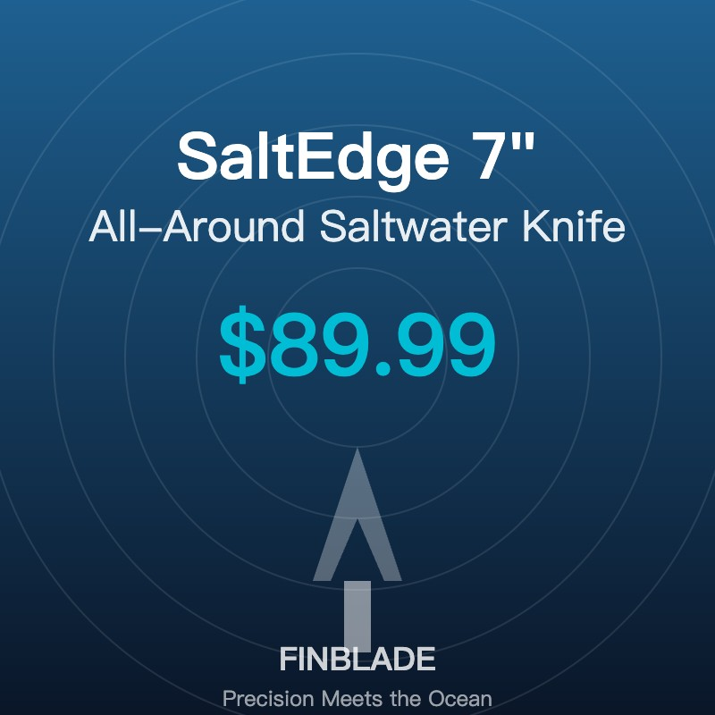

# FinBlade - Premium Fishing Knives Website

A professional, responsive single-page website for the FinBlade fishing knife brand, designed for North American saltwater anglers.

## 🌊 Features

- **Fully Responsive Design** - Works perfectly on desktop, tablet, and mobile
- **Modern Ocean Theme** - Premium titanium alloy aesthetic with DLC coating inspiration
- **3 Product Showcase** - SaltEdge 7", TideFlex 9", MiniCatch 5"
- **Interactive Elements** - Smooth scrolling, hover effects, scroll animations
- **Conversion-Optimized** - Clear CTAs and order form
- **SEO Ready** - Semantic HTML structure

## 📁 File Structure

```
finblade-website/
├── index.html          # Main HTML file
├── styles.css          # Complete styling (ocean theme)
├── script.js           # Interactive functionality
└── README.md           # This file
```

## 🚀 Free Hosting Options

### Option 1: GitHub Pages (Recommended)

1. **Create a GitHub account** at https://github.com

2. **Create a new repository:**
   ```bash
   cd /Users/skyhuang/lobsterai/project/finblade-website
   git init
   git add .
   git commit -m "Initial FinBlade website"
   git branch -M main
   git remote add origin https://github.com/YOUR_USERNAME/finblade.git
   git push -u origin main
   ```

3. **Enable GitHub Pages:**
   - Go to repository Settings → Pages
   - Source: Deploy from `main` branch
   - Your site will be live at: `https://YOUR_USERNAME.github.io/finblade/`

### Option 2: Netlify (Easiest)

1. **Sign up** at https://netlify.com

2. **Drag & Drop:**
   - Log in to Netlify
   - Drag the entire `finblade-website` folder to the Netlify dashboard
   - Site goes live instantly at: `https://random-name.netlify.app`

3. **Customize domain name** in Site Settings → Domain Management

### Option 3: Vercel

1. **Sign up** at https://vercel.com

2. **Deploy:**
   ```bash
   npm install -g vercel
   cd /Users/skyhuang/lobsterai/project/finblade-website
   vercel
   ```

## 🌐 Domain Registration

### Free Domain Options

1. **Freenom** (https://freenom.com)
   - Free domains: `.tk`, `.ml`, `.ga`, `.cf`, `.gq`
   - Note: Less professional, but completely free

2. **GitHub Student Developer Pack**
   - Free `.me` domain for 1 year
   - Apply at: https://education.github.com/pack

### Premium Domain Options (Recommended for Business)

1. **Namecheap** - https://namecheap.com
   - `.com` domains: ~$10-15/year
   - Often includes free privacy protection

2. **Google Domains** - https://domains.google
   - `.com` domains: ~$12/year
   - Clean interface, reliable

3. **Porkbun** - https://porkbun.com
   - Competitive pricing, free WHOIS privacy

### Connect Custom Domain

**For GitHub Pages:**
1. Buy your domain (e.g., `finbladeknives.com`)
2. In GitHub repo: Settings → Pages → Custom Domain
3. Enter your domain name
4. Update DNS records at your domain registrar:
   - Type: `A`, Name: `@`, Value: `185.199.108.153`
   - Type: `A`, Name: `@`, Value: `185.199.109.153`
   - Type: `A`, Name: `@`, Value: `185.199.110.153`
   - Type: `A`, Name: `@`, Value: `185.199.111.153`

**For Netlify:**
1. Buy your domain
2. In Netlify: Site Settings → Domain Management → Add Custom Domain
3. Follow Netlify's DNS setup instructions (easier than GitHub Pages)

## 💰 E-commerce Integration

To accept actual payments, integrate one of these services:

1. **Stripe** - https://stripe.com
   - Replace the form submission with Stripe Checkout
   - Professional, trusted by major brands

2. **PayPal Buttons** - https://paypal.com/buttons
   - Easiest to implement
   - Good for small businesses

3. **Snipcart** - https://snipcart.com
   - Add shopping cart to any HTML site
   - No backend required

4. **Gumroad** - https://gumroad.com
   - Simple product pages
   - Handles everything (payments, delivery, taxes)

## 🎨 Customization

### Change Colors
Edit `styles.css` CSS variables:
```css
:root {
    --ocean-dark: #0a1628;      /* Main dark blue */
    --ocean-light: #1e6091;     /* Accent blue */
    --titanium: #546e7a;        /* Titanium gray */
    --accent: #00bcd4;          /* Call-to-action color */
}
```

### Update Products
Edit the product section in `index.html`:
- Product names
- Prices
- Descriptions
- Features list

### Add Product Images
Replace the emoji placeholders with actual product photos:
```html
<div class="product-image">
    
</div>
```

## 📱 Testing

Test the website locally:
```bash
cd /Users/skyhuang/lobsterai/project/finblade-website
python3 -m http.server 8000
# Visit http://localhost:8000
```

Or use Live Server extension in VS Code.

## 🎯 Next Steps

1. ✅ Website is ready to deploy
2. 📸 Add real product photography
3. 🔗 Connect payment processor (Stripe/PayPal)
4. 🌐 Register custom domain
5. 📊 Add Google Analytics for tracking
6. 📧 Set up email for customer inquiries
7. 📱 Create social media accounts (Instagram, Facebook)

## 📞 Support

For questions or customization help, this website was created by LobsterAI.

---

**FinBlade** - Precision Meets the Ocean 🔪🌊
